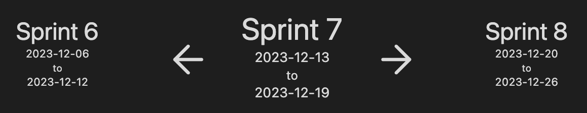

# Journals for Obsidian

Manage your journals in [Obsidian](https://obsidian.md/) knowledge base.

- Calendar based journals (daily, weekly, monthly, quarterly and yearly notes)
- Interval based journals (like financial quarters or sprints)
- You can configure many different journals based on your needs
- Every note type configured separately (path to store, templates etc)
- Variables to insert journal related data into paths/note name/template content.
- Creating current journal notes on vault open
- Opening journal note on startup
- Code blocks for journal notes for easier navigation

## Installation

Follow the steps below to install Tasks.

1. Search for "Journals" in Obsidian's community plugins browser
2. Enable the plugin in your Obsidian settings (find "Journals" under "Community plugins").
3. Check the settings. Configure journals that you need.

## Compatibility with other plugins

- `Daily notes` core plugin - this plugin intends to be a replacement for it. Notes created through Daily notes will not be connected to any journal so it is advised to disable this plugin.
- `Periodic Notes` community plugin - this plugin was initially inspired by Periodic notes that seem to abandoned and aims to be a replacement for it.
- `Calendar` community plugin - starting 1.1.0 this plugin has calendar view similar to calendar plugin. It does not have all the features of calendar plugin as of now, but will gradually catch up.
- `Templater` community plugin - starting with 1.3.0 plugin supports Templater templates in its settings. Journal plugin variables are replaced first and can be used inside templater commands.

### Templater caveats

There can be cases when Templater starts interfering with plugin actions resulting in partially broken note or journal related data removed from frontmatter.
The best setup to avoid such problems would be:

- template configured in journal plugin settings
- `Trigger Templater on new file creation` is disabled
- OR `Trigger Templater on new file creation` is enabled, `Enable Folder Templates` is enabled, **NO** Folder template is configured

This ensures that only journal plugin is processing note template thus avoiding conflicts with templater plugin (journal plugin will use templater itself under the hood to process templater commands).

## Supported variables

There variables can be used in note name template, note storage path, content of template note.

- `{{journal_name}}` - name of journal note belongs to
- `{{note_name}}` - name of note
- `{{start_date}}` - first day of week, month, quarter, year or interval depending on note type, formatted using date format from settings. Format can be overridden using following syntax `{{start_date:format}}` where format is string using [Moment.js format rules](https://momentjs.com/docs/#/displaying/format/) (like `{{start_date:YYYY-MM-DD}}`). You can do date manipulations using [Moment.js manipulation rules](https://momentjs.com/docs/#/manipulating/add/), e.g. `{{start_date+5d:format}}` to add 5 days.
- `{{end_date}}` - last day of week, month, quarter, year or interval depending on note type, formatting rules are the same as in `{{start_date}}`, as well as the calculations
- `{{date}}` - alias to `{{start_date}}`
- `{{index}}` - available for interval based journals indicating index of interval (like financial quarter or spring number)

## Supported code blocks

For easier navigation plugin provides code blocks that can be inserted into note content.

````markdown
```calendar-nav

```
````

Navigation code block helps navigating relative to current note.

Example look for daily note:


---

````markdown
```interval-nav

```
````

This block is similar to previous one just for interval based journals.

Example look for interval note (configured as 1 week sprints):



---

````markdown
```calendar-timeline

```
````

Timeline code blocks helps navigating daily notes in bigger periods (like week, month, quarter or year). By default daily and weekly notes show `week` timeline, monthly note - `month` timeline, quarter note - `quarter` timeline and yearly note - `calendar` timeline. This can be changed using `mode` param.

````markdown
```calendar-timeline
mode: month
```
````

Sample week timeline


Sample month timeline


Quarter and Calendar timeline repeat month timeline for every month in quarter or year.

## Contributing

Contributions via bug reports, bug fixes, documentation, and general improvements are always welcome. For more major feature work, make an issue about the feature idea / reach out to me so we can judge feasibility and how best to implement it.
