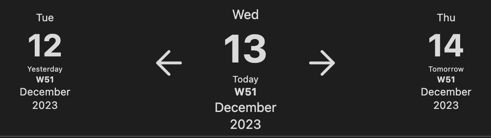
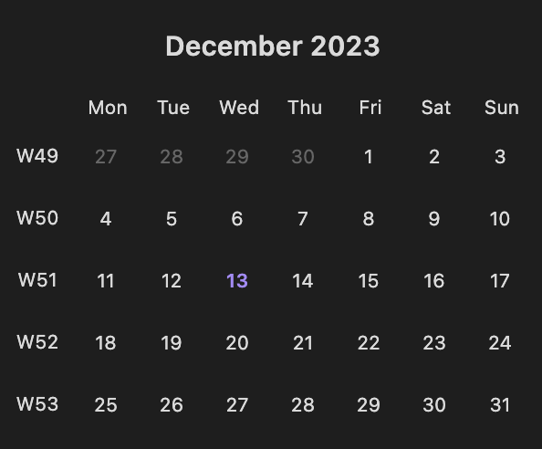

# Journals for Obsidian

A comprehensive journaling solution for [Obsidian](https://obsidian.md/) that transforms your note-taking experience. This plugin helps you create, organize, and navigate structured journal entries across multiple timeframes, from daily notes to custom periods. Whether you're tracking daily work logs, organizing research notes by week, or managing project sprints, Journals provides powerful tools for consistent formatting, easy navigation, and visual organization of your time-based notes.

## Key Features

### Journal Types

- **Standard Intervals**: Daily, weekly, monthly, quarterly, and yearly notes
- **Custom Periods**: Create notes for any custom duration (sprints, financial quarters)
- **Index Support**: Auto-number entries (Sprint 1, Sprint 2, Quarter 3)
- **Multiple Journals**: Set up different journals for different aspects of your life

### Visual & Navigation

- **Calendar View**: Built-in calendar for easy date navigation
- **Timeline View**: Navigate through time periods with customizable code blocks
- **Note Decorations**: Visually highlight notes based on contents, dates, or status
- **Navigation Blocks**: Quick links to related journal entries

### Organization

- **Journal Shelves**: Group related journals together
- **Custom Commands**: Create shortcuts for your most common journal operations
- **Templating**: Powerful variable system for consistent journal entries
- **Frontmatter**: Automatic metadata for better organization

### Smart Features

- **Auto-creation**: Automatically create current period's journal
- **Date Boundaries**: Define start/end dates for journal periods
- **Bulk operations**: Create multiple notes at once
- **Templater Support**: Works with Obsidian's popular templating plugin

## Installation

Follow the steps below to install plugin.

1. Search for "Journals" in Obsidian's community plugins browser
2. Enable the plugin in your Obsidian settings (find "Journals" under "Community plugins").
3. Check the settings. Configure journals that you need.

## Settings

The Journals plugin offers extensive configuration options to customize your journaling experience. This section covers the main settings you'll encounter.

### Global Settings

- **Use Shelves**: Enable this option to organize journals into logical groups (like work, personal, projects). Shelves allow you to:

  - Filter the calendar view to show only journals from a specific shelf
  - Limit decorations in navigation blocks to the current shelf
  - Manage related journals together

- **Open on Startup**: Choose a journal that will automatically open when you launch Obsidian. Select "Don't open" to disable this feature.

### Calendar Settings

- **Week Start**: Choose which day starts your week (Monday, Sunday, etc.)
- **Calendar View Position**: Display the calendar in the left or right sidebar
- **Week Numbers**: Show week numbers before or after weekdays, or hide them
- **Today Button Mode**:

  - Create note: Creates today's note if it doesn't exist
  - Navigate: Opens existing note only
  - Switch date: Just switches calendar view to current month

- **Calendar Highlighting**:
  - Customize today's date highlight (text and background colors)
  - Customize active note highlight (text and background colors)

### Journal Configuration

Each journal can be configured separately with these settings:

- **Journal Type**:

  - Fixed intervals: day, week, month, quarter, year
  - Custom intervals: specify duration (e.g., 2-week sprints)
  - Weekday-based: create notes only on specific weekdays

- **Note Creation**:

  - Name template: Set the note filename pattern
  - Date format: Define how dates appear
  - Folder path: Where notes will be stored
  - Template: Select template(s) for note content
  - Auto-create: Automatically create current period's note
  - Confirm creation: Prompt before creating notes

- **Chronology Settings**:

  - Start date: When this journal begins
  - End conditions: When to stop creating notes (never, specific date, after N repeats)

- **Index Settings**: For numbered entries (like "Sprint 1")

  - Enable indexing
  - Set anchor date and initial index
  - Choose increment type (continuous or reset after N entries)

- **Frontmatter**: Customize frontmatter fields
  - Date field name
  - Add start/end dates
  - Index field name

### Decoration System

Journals provides a powerful decoration system to visually distinguish notes in the calendar view and navigation blocks:

- **Decorations**: Each journal can have multiple decorations that visually mark notes based on conditions
- **Conditions**: Apply decorations based on:

  - **Note Content**: Title contains text, has specific tags, frontmatter properties
  - **Date-based**: Specific dates, weekdays, relative offsets
  - **Note Status**: Has note, has open tasks, all tasks completed

- **Styles**: Customize appearance with:

  - Background color
  - Text color
  - Borders (uniform or per-side with custom width, color, style)
  - Shapes (square, circle, triangle in various positions)
  - Corner markers
  - Icons (from Obsidian's icon set)

- **Combinations**: Use AND logic (all conditions must match) or OR logic (any condition can match)

### Custom Commands

Create custom commands to quickly navigate between journal notes:

- **Command Types**:

  - Same date in current/next/previous period (e.g., "same day next week")
  - Next/previous entry in the same journal
  - Combined navigation (e.g., "same day in next month")

- **Context Settings**:

  - Today: Command always available, uses today as reference
  - Open note: Command available when any note is open
  - Only open note: Command only available when a note from this journal is open

- **UI Integration**:
  - Add to ribbon bar with custom icon
  - Opening mode (active pane, new tab, split, window)

### Navigation Blocks

Configure code blocks that help navigate between journal entries:

- **Block Types**:

  - Navigation block: Navigate relative to current note
  - Calendar view block: Shows calendar for the current period

- **Entry Line Customization**:

  - Template text with variables (like date formatting)
  - Font styles (size, bold, italic)
  - Colors (text and background)
  - Linking behavior (link to self, current journal, or specific period)
  - Apply visual decorations to entries

- **Settings**:
  - Creation mode (create missing notes or only show existing)
  - Whole block decoration

## Compatibility with other plugins

- `Daily notes` core plugin - this plugin intends to be a replacement for it. Notes created through Daily notes will not be connected to any journal so it is advised to disable this plugin.
- `Periodic Notes` community plugin - this plugin was initially inspired by Periodic notes that seem to abandoned and aims to be a replacement for it.
- `Calendar` community plugin - starting 1.1.0 this plugin has calendar view similar to calendar plugin. It does not have all the features of calendar plugin as of now, but will gradually catch up.
- `Templater` community plugin - starting with 1.3.0 plugin supports Templater templates in its settings. Journal plugin variables are replaced first and can be used inside templater commands.

### Templater caveats

There can be cases when Templater starts interfering with plugin actions resulting in partially broken note or journal related data removed from frontmatter.
The best setup to avoid such problems would be:

- template configured in journal plugin settings
- `Trigger Templater on new file creation` is disabled
- OR `Trigger Templater on new file creation` is enabled, `Enable Folder Templates` is enabled, **NO** Folder template is configured

This ensures that only journal plugin is processing note template thus avoiding conflicts with templater plugin (journal plugin will use templater itself under the hood to process templater commands).

## Supported variables

There variables can be used in note name template, note storage path, content of template note.

- `{{journal_name}}` - name of journal note belongs to
- `{{note_name}}` - name of note
- `{{date}}` - date used as reference to specific period, formatted using date format from settings. In most cases it is first day of month, quarter, year or custom interval. The only exception is week notes where for notes that belong to next year but have some days in previous year it will be set to end of week. Format can be overridden using following syntax `{{start_date:format}}` where format is string using [Moment.js format rules](https://momentjs.com/docs/#/displaying/format/) (like `{{start_date:YYYY-MM-DD}}`). You can do date manipulations using [Moment.js manipulation rules](https://momentjs.com/docs/#/manipulating/add/), e.g. `{{start_date+5d:format}}` to add 5 days.
- `{{start_date}}` - first day of week, month, quarter, year or interval depending on note type, formatting rules are the same as in `{{date}}`, as well as the calculations
- `{{end_date}}` - last day of week, month, quarter, year or interval depending on note type, formatting rules are the same as in `{{date}}`, as well as the calculations
- `{{index}}` - available for interval based journals indicating index of interval (like financial quarter or spring number)

## Supported code blocks

For easier navigation plugin provides code blocks that can be inserted into note content.

````markdown
```journal-nav

```
````

Navigation code block helps navigating relative to current note. Displayed data is configured in journal settings.

Example look for daily note:



---

````markdown
```calendar-timeline

```
````

Timeline code blocks helps navigating daily notes in bigger periods (like week, month, quarter or year). By default daily and weekly notes show `week` timeline, monthly note - `month` timeline, quarter note - `quarter` timeline and yearly note - `calendar` timeline. This can be changed using `mode` param.

````markdown
```calendar-timeline
mode: month
```
````

Sample week timeline


Sample month timeline



Quarter and Calendar timeline repeat month timeline for every month in quarter or year.

---

````markdown
```journals-home

```
````

Displays list of links to current notes in journals.
Supports following settings:

- `show` - controls what journals are displayed (by default only Today link is displayed). Supported values are - `day`, `week`, `month`, `quarter`, `year`, `custom`.
- `separator` - used to separate multiple links. Default - `•`.
- `scale` - allows to increase size of links. Used as multiplier of text size - so to have links twice as big as regular text use `2`. Default - `1`.
- `shelf` - allows to limit journal displayed in block to some specific shelf.

````markdown
```journals-home
show:
  - day
  - week
  - month
  - quarter
  - year
  - custom
scale: 2
separator: " | "
shelf: work
```
````

## Advanced Usage

### Using Shelves

Shelves are a powerful way to organize journals into logical groups. Here's how to use them effectively:

1. **Enable Shelves** in the global settings.

2. **Create Shelves** for different areas of your life:

   - Work (meetings, projects, weekly reports)
   - Personal (diary, habit tracking, health)
   - Education (courses, research, study notes)

3. **Assign Journals to Shelves** when creating or editing a journal.

4. **Filter Calendar View** by shelf to focus on specific contexts.

5. **Use Shelf Parameter** in journals-home code block to create dashboard notes for specific contexts.

### Bulk Adding Notes

The plugin allows you to create multiple journal notes at once:

1. Go to the journal settings
2. Click "Bulk Add Notes" next to the journal name
3. Configure date range and options:
   - Start and end dates
   - Options to override existing notes
   - Choose whether to rename/move files

This is useful for:

- Setting up a new journal with past entries
- Creating future planning notes for projects
- Migrating existing notes into a journal

### Common Setup Examples

#### Daily Work Journal

```yaml
Type: Day
Folder: Work/DailyNotes
Name Template: {{date}} Daily Log
Date Format: YYYY-MM-DD
Auto-create: Enabled
Start date: Your employment start date
```

#### Project Sprints

```yaml
Type: Custom
Every: Week
Duration: 2
Folder: Projects/{{journal_name}}/Sprints
Name Template: Sprint {{index}}
Index: Enabled, Increment type
```

#### Academic Term Notes

```yaml
Type: Week
Folder: Education/{{date:YYYY}}/{{date:MMMM}}
Name Template: Week {{index}} - {{start_date:MMM D}} to {{end_date:MMM D}}
Start date: Term start date
End conditions: Date (term end date)
```

## Troubleshooting

### Common Issues

#### Notes are created in the wrong location

- Check your folder path in journal settings
- Verify your note name template doesn't contain illegal characters
- Make sure the folder exists in your vault

#### Template variables aren't working

- Verify syntax: use double braces `{{variable}}`
- For date formatting, use Moment.js syntax (e.g., `{{date:YYYY-MM-DD}}`)
- Check for spaces or typos in variable names

#### Calendar view isn't showing notes

- Ensure notes have proper frontmatter (journal name and date)
- Check if you're filtering by shelf and the journal is assigned to that shelf
- Verify the date format in your journal settings matches your note dates

#### Conflicts with Templater

- Follow the Templater setup in the compatibility section
- Ensure Templater isn't configured to auto-process the same templates
- The recommended setup is to let the Journal plugin handle the template processing

#### Missing decorations

- Verify your condition criteria (tags, properties, dates)
- Check if you're using AND logic when OR might be more appropriate
- Ensure the decoration style settings are properly configured

### What to do if you encounter bugs

1. Check the console for error messages (Ctrl+Shift+I in Obsidian)
2. Verify you're using the latest version of the plugin
3. Try with a minimal configuration to isolate the issue
4. Report bugs on [GitHub](https://github.com/srg-kostyrko/obsidian-journal/issues) with:
   - Steps to reproduce
   - Expected behavior
   - Actual behavior
   - Console logs if available
   - Plugin version and Obsidian version

## Glossary

**Frontmatter**: Metadata at the top of your note, surrounded by `---` lines. The Journal plugin uses frontmatter to store journal name, dates, and other information.

**Decoration**: Visual indicators that mark or highlight specific days in the calendar view based on conditions you set. They can include colors, shapes, icons, or borders.

**Journal Shelf**: A grouping mechanism to organize multiple journals together (like "Work" or "Personal"). Helps you filter and focus on specific journal contexts.

**Navigation Block**: A special code block that generates navigation links between journal entries, customized to each journal type.

**Timeline**: A calendar-like view that displays days of a specific period (week, month, etc.) with links to corresponding journal entries.

**Index**: A sequential number assigned to journal entries (like Sprint 1, Sprint 2). Useful for tracking iterations or repeating periods.

**Template Variables**: Special placeholders like `{{date}}` or `{{index}}` that the plugin replaces with actual values when creating notes.

## Contributing

Contributions via bug reports, bug fixes, documentation, and general improvements are always welcome. For more major feature work, make an issue about the feature idea / reach out to me so we can judge feasibility and how best to implement it.
