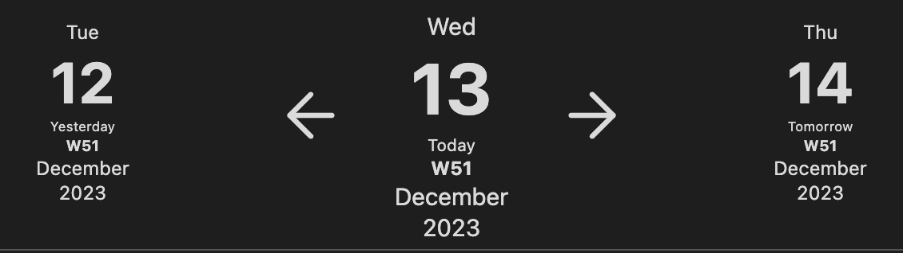
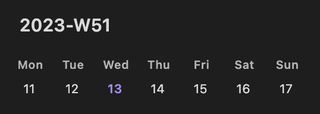
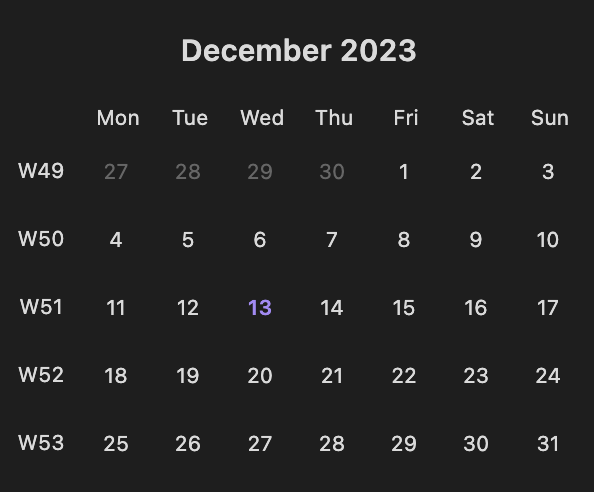

# Journals for Obsidian

A comprehensive journaling solution for [Obsidian](https://obsidian.md/) that transforms your note-taking experience. This plugin helps you create, organize, and navigate structured journal entries across multiple timeframes, from daily notes to custom periods. Whether you're tracking daily work logs, organizing research notes by week, or managing project sprints, Journals provides powerful tools for consistent formatting, easy navigation, and visual organization of your time-based notes.

## Key Features

### Journal Types

- **Standard Intervals**: Daily, weekly, monthly, quarterly, and yearly notes
- **Custom Periods**: Create notes for any custom duration (sprints, financial quarters)
- **Sequential Numbers**: Auto-number entries (Sprint 1, Sprint 2, Quarter 3)
- **Multiple Journals**: Set up different journals for different aspects of your life

### Visual & Navigation

- **Configurable Views**: Build your own views by composing blocks — month calendars, week calendars, custom-interval lists, toolbars, dividers, and rendered markdown templates — and fill each toolbar with items (shelf selector, period buttons, existing-note navigation, buttons, spacers); open each view in the left or right sidebar or as a tab
- **Timeline View**: Navigate through time periods with customizable code blocks
- **Note Decorations**: Visually highlight notes based on contents, dates, or status, vault-wide, per shelf, or per journal
- **Navigation Blocks**: Quick links to related journal entries
- **Date Picker**: Drill down across day, week, month, quarter, year, and decade

### Organization

- **Journal Shelves**: Group related journals together and target commands and views at a whole shelf
- **Custom Commands**: Create shortcuts for your most common journal operations, including opening the next, previous, or nearest existing note, and target them at one journal, a whole shelf, or every journal of one period type
- **Templating**: Powerful variable system for consistent journal entries, with Templater support
- **Frontmatter**: Automatic metadata for better organization
- **Auto-attach**: Notes you create yourself are connected to a journal automatically when their path matches that journal's folder and name template, the date it resolves to falls within that journal's timeline, and no other journal matches the same note

### Integrations & Tooling

- **URI Scheme**: Open (and create, applying templates) journal notes via `obsidian://` links
- **Insert Link to Journal Note**: Command to insert a link to any journal date at the cursor
- **Translated Interface**: The interface follows Obsidian's language setting, with translations for ten languages besides English (Chinese, German, French, Russian, Spanish, Portuguese, Japanese, Korean, Italian, Ukrainian)
- **Theming Hooks**: Stable class names on the plugin's code blocks, so themes and CSS snippets can restyle them
- **Logging**: Capture plugin activity and dump it to a note for troubleshooting

## Installation

Follow the steps below to install plugin.

1. Search for "Journals" in Obsidian's community plugins browser
2. Enable the plugin in your Obsidian settings (find "Journals" under "Community plugins").
3. Check the settings. Configure journals that you need.

## Settings

The Journals plugin offers extensive configuration options to customize your journaling experience. This section covers the main settings you'll encounter.

### Global Settings

- **Shelves**: Organize journals into logical groups (like work, personal, projects). Shelves let you:

  - Scope views to show only journals from a specific shelf
  - Limit decorations in navigation blocks to the current shelf
  - Decorate every journal on the shelf from one place
  - Target commands and views at a whole shelf
  - Manage related journals together

- **Open on startup**: Pick one journal whose current note opens whenever you open the vault. Views carry their own, separate _Open on startup_ toggle.
- **Calendar decorations**: Decorations that apply to every calendar, whatever journals are on screen. See the decoration system below.
- **Week numbers**: Set the global default for where the week-number column appears (before weekdays, after weekdays, or hidden — the default is before); individual view blocks and the `calendar-timeline` code block can override it.
- **Timeline navigation**: Set the global default for whether `calendar-timeline` code blocks carry previous/next controls (off by default); an individual block can override it with its `navigation` option.
- **Logging**: Set the log level (debug, info, warn, or error — the default is warn) and dump captured activity to a note for troubleshooting.

### Calendar Settings

- **Week configuration**: Follow the locale, or choose a preset that sets both which day starts the week and how the first week of the year is determined — the two together decide week numbers. A custom preset can optionally be applied to Obsidian globally rather than only inside this plugin.
- **Calendar highlighting**:
  - Customize today's date highlight (text and background colors)
  - Customize active note highlight (text and background colors)

### View & Block Settings

A view is a list of blocks. The available blocks are:

- **Month calendar** — one or more month grids around the selected date
- **Week calendar** — one or more week strips around the selected date
- **Custom intervals** — the entries of your custom journals that fall inside a chosen window (current week, month, quarter, or year)
- **Toolbar** — a container for toolbar items: a shelf selector, period buttons, previous/next existing-note buttons, custom buttons, and flexible spacers
- **Divider** — a horizontal rule between blocks
- **Markdown template** — renders a template note inline, with journal variables replaced (see [Supported variables](#supported-variables))

Each view has:

- **Open in**: Left sidebar, right sidebar, or a new tab
- **Icon** and **Show in ribbon**: Give the view an icon and a ribbon button that opens it
- **Default shelf**: The shelf the view starts on when it opens
- **Open on startup**: Automatically open the view when Obsidian launches
- **Remember last viewed date**: Reopen on the date you last looked at instead of on today
- **Follow active note**: Move the view to the date of the journal note you open

Calendar blocks add:

- **Months / weeks before and after**: How many extra grids to show around the selected one
- **Week numbers**: Use the global default, or force before weekdays, after weekdays, or hidden
- **Days of the week**: Hide specific weekdays (e.g., weekends) from the grid
- **Show month/year heading**: Show or hide the heading above the grid

### Journal Configuration

Each journal can be configured separately with these settings:

- **Note creation**:

  - Note name template: Set the note filename pattern
  - Folder: Where notes will be stored
  - Default date format: How dates appear when a variable doesn't give its own format
  - Confirm creating new notes: Prompt before creating a note you navigate to
  - Auto-create today's note: Create it on plugin load and at every local midnight

- **Templates**: Select one or more template notes for new note content

- **Timeline**:

  - Start writing on: When this journal begins
  - End writing: When to stop creating notes (never, after a date, or after N repeats)

- **Sequential numbers**: For numbered entries (like "Sprint 1"), and for chained ones (like "Release4711Sprint1")

  - Enable sequential numbers
  - A journal's numbering is an ordered list of **digits**, slowest first. The last (fastest)
    digit advances once per note; when it wraps around, it carries into the digit above it, the
    way a car odometer's ones wheel turns the tens wheel. Each digit has its own:
    - **Variable name**, used as `{{name}}` in the note name template and folder path
    - **Start number**
    - **Reset rule** — only the first (slowest) digit can be set to _Continuous_ (never resets);
      every digit below it resets after a fixed count, shown as "how many per _\<the digit above
      it\>_"
    - **Frontmatter property** the digit's number is stored in
  - Anchor date: The note on the anchor date gets every digit's start number, and later notes count up from there
  - Digits can only be added at the bottom, as a new fastest digit — there is no way to insert a
    slower one above the current top. To turn a single-counter journal into a chained one (say,
    adding Release above an existing Sprint), rename the existing digit to `release`, give it its
    new start number, and add a finer `sprint` digit beneath it
  - The last remaining digit cannot be deleted; deleting the slowest one promotes the next digit
    to take its place
  - Allow before anchor: Permit numbering earlier notes, which may produce negative numbers. Offered only when the journal has no start date and the slowest digit is Continuous
  - A live **preview** shows the full paths of the next five notes the current configuration
    produces, so a digit used only in the folder template is visible too
  - A note named only by its digits (no date anywhere in the name or folder) can still auto-attach
    to its journal, but only when the slowest digit is Continuous **and** every digit appears in
    the name or folder template. When it can't, the note creation and sequence sections warn with
    the specific reason: which digits the template leaves out, which digit resets and so repeats
    its numbers forever, or which digit below the slowest never resets and so freezes every digit
    above it

  For example, a name template of `Release{{release}}Sprint{{sprint}}` with `release` starting at
  4711 (Continuous) and `sprint` starting at 1 (6 per release) produces `Release4711Sprint1` …
  `Release4711Sprint6`, then `Release4712Sprint1`.

- **Frontmatter**: Customize the properties the plugin writes
  - Date property name
  - Add start date property, with its own property name
  - Add end date property, with its own property name

Every journal row also has a **clone** action. The copy carries the source's whole configuration
under a new name, joins the same shelf, and gets its own copy of the source's commands. Notes are
never copied. The copy starts out with the source's folder and note name template, so the two
resolve to the same note paths until you change one — the colliding journals warning says so until
you do.

### Decoration System

Journals provides a decoration system to visually distinguish notes in calendars and navigation blocks. Decorations live in three scopes:

- **Calendar decorations** on the main settings page apply to every calendar, whatever journals are on screen
- **Shelf decorations** on a shelf apply while that shelf is in view
- **Journal decorations** on a journal apply to that journal's notes

They **layer**: for each property a cell can only have once — background, text color, each border side, each corner — the most specific scope wins, resolved vault-wide first, then shelf, then journal. Shapes and icons never compete; they stack in the nine placement slots.

- **Conditions**: which conditions are offered depends on the scope

  - **Note content** (journal decorations): Title, tag, or frontmatter property. Titles and tags match by contains, starts with, or ends with; properties also offer exists, equals, comparisons, and true/false for checkboxes
  - **Note status** (journal decorations): Has note, has open tasks, all tasks completed
  - **Note size** (journal decorations): Matches on the note's word or character count, using the same definition as Obsidian's own word count — frontmatter is not counted, everything else is, including code blocks and comments. The number is the one Obsidian shows in the status bar.
  - **Date and weekday** (calendar and shelf decorations, and daily journals): A specific day, month, and/or year — each of which can be left as "any" — or a set of weekdays
  - **Position** (custom-interval journals): The Nth day of the interval, counted from its start or from its end

- **Styles**: Customize appearance with:

  - Background color
  - Text color
  - Borders (uniform or per-side with custom width, color, style)
  - Shapes (square, circle, or a triangle pointing up, down, left, or right, in nine positions)
  - Corner markers
  - Icons (from Obsidian's icon set)

  Every color can be transparent, a theme color, or a custom color. A transparent color cancels what a less specific scope painted.

- **Combinations**: Use AND logic (all conditions must match) or OR logic (any condition can match)

- **Match badge**: Each decoration in the settings list reports how often it matched recently ("Matched 3 of the last 90 days"), so a rule that never fires is easy to spot. A note-size rule shows no badge — estimating it would mean reading every note in the window

- **Decoration breakdown**: Right-click a decorated cell — in a calendar, a navigation block, or a toolbar's period buttons — and choose _Explain decorations_ to see, property by property, which rule produced each color, border, and mark, and which rules it overrode

- **Inspect a date**: From any decorations section, open _Inspect a date_ to pick a date and a shelf and see everything decorating it across all three scopes

- **Recipes**:

  - **Coming from the Calendar plugin?** Its "words per dot" ladder (default 250, capped at five dots) becomes five decorations here, each with one dot style: a _has note_ condition, then note size > 500, > 750, > 1000, and > 1250
  - **One dot per band, instead of a growing row**: add two note-size conditions to the same decoration — >= 250 and < 1000 — and it matches only inside that band, so each band can carry its own color or shape

### Custom Commands

The plugin ships a set of commands for opening the current, next, and previous note of each period type. You can create more:

- **Command types**:

  - Current note for the reference date
  - Next/previous entry in the journal
  - Next/previous _existing_ note (skips gaps to the nearest note that exists)
  - Combined navigation: the same date in the next or previous week, month, or year

- **Targets**: Point a command at one journal, at a whole shelf, or at every journal of a given note type. Journal and shelf commands are prefixed with that name in the command palette.

- **Context** — which note's date the command treats as the current date:

  - Today: Always available, uses today
  - Open note's date, or today: Uses the open journal note's date, falling back to today
  - Open note's date only: Runs only while a journal note is open

- **UI integration**:
  - Add to the ribbon with a custom icon
  - Open note: replacing the active note, in a new tab, next to the active note, or in a popout window

### Navigation Blocks

Each journal configures two line lists, both edited the same way:

- **Navigation block**: The lines the `journal-nav` code block renders inside a note of this journal. Each journal type ships a sensible default you can reset to.
- **Calendar interval lines**: The lines a custom-interval journal's entries get in the _Custom intervals_ view block.

A **line** is one or more **segments** placed side by side. A line starts as a
single segment; splitting it off into its own line (or joining two segments back
into one, or dragging a segment onto another line) is done from the settings
preview, not through a separate control. Each segment has its own:

- Template text with variables (see [Supported variables](#supported-variables))
- Font size, relative to regular text, plus bold and italic
- Colors (text and background)
- Link: none, the segment's own note, another journal's current note, or the note for the containing day, week, month, quarter, or year
- **Link date**: shift the date the link opens, using the same syntax as template date variables — see [Date modifications](#date-modifications) — for example `+1q` to open next quarter's note instead of this quarter's, or `<startOf=month>` to always land on the first day of the month. Leave it empty to open the date the link would open anyway.
- Add decorations: apply the matching visual decorations to the segment. A decorated segment shows the decorations of the note its link opens, not the host note's — a segment linking to the year journal decorates from the year's own rules, not the day's.

The `nav-row` CSS class on each segment is a stable styling hook, kept for user
CSS snippets and existing selectors even though the segment vocabulary above
replaced "row".

**Settings**:

- Mode: create a new note when a segment is clicked, or only open notes that already exist
- Whole block decoration: decorate the block as a whole from the current journal's rules

### Maintenance

A settings page for recovering from vault or settings damage. It does nothing on its own — open it from **Settings → Journals → Maintenance** when you suspect something is wrong.

**Settings snapshots**: Before your settings are migrated to a new plugin version, and before you restore an earlier snapshot, a copy of the current settings file is saved automatically. The page lists every snapshot it finds, what it was taken before, and lets you restore one with a click — which itself snapshots whatever it's about to overwrite first. Migration snapshots are kept indefinitely; the three most recent pre-restore snapshots are kept.

**Vault check**: Scans every note that claims a journal in its frontmatter for four kinds of mismatch:

- **Notes the calendar can't see** — a note's stored date no longer matches its journal, usually from a note opened while that journal was misconfigured.
- **Notes with the wrong period range** — a note's start/end dates no longer match the period its own date falls in.
- **Two notes claiming the same period** — you pick which one keeps it; the other has its journal keys removed, its content left otherwise untouched.
- **Notes claiming a journal that no longer exists** — shown as an inventory rather than a problem, since deleting a journal while keeping its notes is a deliberate choice. Remove the leftover keys, or reconnect the notes to a different journal with the "Connect note to a journal" command.

A finding the check can repair safely shows a **Fix** button, or use **Fix everything safe** to apply every safe repair at once. A finding it cannot safely resolve — for example, when a note's file name and its own date disagree about which period it belongs to — is listed with an explanation instead of a guess, so you can open the note and decide. The page re-scans after every repair and only reports a note fixed once Obsidian has confirmed the change landed.

Findings are computed against your journals as currently configured, so if you suspect your settings themselves are wrong, restore a snapshot first — repairing notes against a broken configuration can make things worse.

## Compatibility with other plugins

- `Daily notes` core plugin - this plugin intends to be a replacement for it. Notes created through Daily notes will not be connected to any journal so it is advised to disable this plugin.
- `Periodic Notes` community plugin - this plugin was initially inspired by Periodic notes that seem to abandoned and aims to be a replacement for it.
- `Calendar` community plugin - this plugin builds its own calendar views out of blocks and aims to be a replacement for it. There is no integration between the two.
- `Templater` community plugin - starting with 1.3.0 plugin supports Templater templates in its settings. Journal plugin variables are replaced first and can be used inside templater commands.

### Templater caveats

There can be cases when Templater starts interfering with plugin actions resulting in partially broken note or journal related data removed from frontmatter.
The best setup to avoid such problems would be:

- template configured in journal plugin settings
- `Trigger Templater on new file creation` is disabled
- OR `Trigger Templater on new file creation` is enabled, `Enable Folder Templates` is enabled, **NO** Folder template is configured

This ensures that only journal plugin is processing note template thus avoiding conflicts with templater plugin (journal plugin will use templater itself under the hood to process templater commands).

## Supported variables

These variables can be used in the note name template, the folder path, and the content of a template note. Each journal's settings has a **Supported variables** link that opens the same list for that journal, with its own date format and numbering variables filled in.

- `{{journal_name}}` - name of journal note belongs to
- `{{date}}` - date used as reference to specific period, formatted using date format from settings. In most cases it is the first day of the month, quarter, year or custom interval. The exception is week notes, where `{{date}}` renders the week's representative day rather than its first day — the day whose calendar year is the week's own year, which is the Thursday under the ISO-8601 week configuration. This is what makes `{{date:YYYY}}` resolve to the right year on a week straddling January 1, whichever week configuration you use. Format can be overridden using following syntax `{{date:format}}` where format is string using [Moment.js format rules](https://momentjs.com/docs/#/displaying/format/) (like `{{date:YYYY-MM-DD}}`).
- `{{start_date}}` - first day of week, month, quarter, year or interval depending on note type, formatting rules are the same as in `{{date}}`, as well as the calculations
- `{{end_date}}` - last day of week, month, quarter, year or interval depending on note type, formatting rules are the same as in `{{date}}`, as well as the calculations
- `{{week_of_month}}` - which week of its month the note's week is, counting the week that holds the 1st of the month as week 1. It follows the start of the week configured in the plugin's calendar settings, so it agrees with the week numbers the calendar shows.
  Because a week can straddle two months, the month it counts within is whichever month the date it is read from falls in. Date modifications choose that date: `{{week_of_month}}` counts within the note's own month, while `{{week_of_month<endOf=week>}}` counts within the month the week ends in — which moves a whole straddling week into the later month. Pair it with a month rendered the same way so the two agree: `{{date<endOf=week>:MMMM}} week {{week_of_month<endOf=week>}}` names August 31 2026 "September week 1".
  It can be offset and rendered as an ordinal like a numbering variable (`{{week_of_month-1}}`, `{{week_of_month:o}}`).
  It is computed from the date rather than stored, so a note name built from it is still recognized as the journal's own — but changing the start of the week later changes what the plugin would name a note, while notes already on disk keep the name they were created with.
- `{{index}}` - a journal's numbering variable; its first (and by default only) digit is named
  `index` unless renamed. A journal can chain several digits together, each under its own
  variable name and frontmatter property — see **Sequential numbers** below; the name you give a
  digit there is the name you use here. Numbering is on by default for custom-interval journals
  and can be enabled for any journal type.
  A numbering variable can be offset and rendered as an ordinal: `{{index+3}}`
  adds three to the rendered value, `{{index-1}}` subtracts one, and
  `{{index:o}}` renders it as an ordinal ("4th"). They combine as
  `{{index+3:o}}`. Both survive the round-trip out of a note name, so a journal
  named `Sprint {{index+3}}` still recognizes its own notes.
- `{{note_name}}` / `{{title}}` - the note's name. Available in the folder path, in template content and in navigation block segments, but not in the note name template itself, since the name has to render first. In a navigation block segment it is the name of the note the segment opens; for a period whose note does not exist yet, the name that note would get.
- `{{current_date}}` - the date the note is rendered on (not the reference period), formatted with `{{current_date:format}}`
- `{{current_time}}` / `{{time}}` - the clock time at render, formatted with `{{time:HH:mm}}`
- `{{relative_date}}` - "Yesterday", "Today", "Last Tuesday", "This month", "3 weeks ago", and so on. Available in navigation block segments.
- `{{journal_link(journal_name)}}` - inside a template note's content, and in the markdown template view block, resolves to the vault path of the corresponding note in another journal. Wrap it in a link or embed yourself, for example `[[{{journal_link(daily)}}]]`.

### Date modifications

Any date or time variable, `{{week_of_month}}`, and `journal_link`, can be shifted before it is formatted:

- `{{date+5d:format}}` adds 5 days. The units are `y` (years), `q` (quarters), `m` (months), `w` (weeks), `d` (days) and `h` (hours), with `+` or `-`, for example `{{date-1w}}` or `{{journal_link(daily)+1d}}`.
- `{{date<startOf=week>}}` and `{{date<endOf=month>}}` snap to a boundary. The units are `decade`, `year`, `quarter`, `month`, `week`, `day` and `hour`.
- Modifications can be combined and go before the `:format`, for example `{{date+1w<startOf=week>:MMM DD, YYYY}}`. Shifts always apply first, then boundaries, then the format override, whatever order you write them in.
- Date variables have day precision, so `h` and `<startOf=hour>` change nothing on them; they only move `{{time}}` and `{{current_time}}`. Conversely, `<startOf=decade>` applies to dates only.

The same list is available in the app: any **additional modifications** link in a journal's settings opens it.

## Supported code blocks

For easier navigation plugin provides code blocks that can be inserted into note content. Each journal's settings has a **Supported code blocks** link that shows the same list with a live preview of that journal's blocks, and copies a block to your clipboard when you click it.

Each block's container carries a stable CSS class — `journal-nav-code-block`, `journal-timeline-code-block` and `journal-home-code-block` — that themes and CSS snippets can target. `calendar-timeline` and `journals-home` name any option they do not recognize in a notice above the block, and still render.

````markdown
```journal-nav

```
````

Navigation code block helps navigating relative to current note. Displayed data is configured in journal settings. `calendar-nav` and `interval-nav` are aliases for the same block, kept for older notes; all three behave identically.

Example look for daily note:



---

````markdown
```calendar-timeline

```
````

Timeline code blocks helps navigating daily notes in bigger periods (like week, month, quarter or year). By default daily and weekly notes show `week` timeline, monthly note - `month` timeline, quarter note - `quarter` timeline and yearly note - `calendar` timeline. Custom interval notes show a `week` timeline, and a note that belongs to no journal shows the current week. This can be changed using `mode` param.

````markdown
```calendar-timeline
mode: month
```
````

Supports following settings:

- `mode` - which period the timeline shows. Supported values are - `week`, `month`, `quarter`, `calendar`. Without it the journal's own period decides, as above.
- `shelf` - limits the displayed notes to a specific shelf. Without it, the shelf holding the current journal is used.
- `weeks` - where the week-number column appears. Supported values are - `default`, `left`, `right`, `none`. `default` follows the plugin's calendar setting.
- `hiddenWeekdays` - hides the listed days of the week, where `0` is Sunday and `6` is Saturday, e.g. `[0, 6]` to drop weekends.
- `before` - adds this many earlier periods above the current one. Applies to the `week` and `month` modes only.
- `after` - adds this many later periods below the current one. Applies to the `week` and `month` modes only.
- `navigation` - shows previous/next controls above the timeline, so you can look at other periods without opening or creating a note. Supported values are - `true`, `false`. Without it, the plugin's **Timeline navigation** calendar setting decides.

To see the previous and next week alongside the current one:

````markdown
```calendar-timeline
mode: week
before: 1
after: 1
```
````

To page through periods without leaving the note:

````markdown
```calendar-timeline
mode: week
navigation: true
```
````

The controls step by the timeline's own period — a week in `week` mode, a month in `month` mode, a quarter in `quarter` mode and a year in `calendar` mode — and name the periods on screen. Paging never opens or creates a note; a reset control appears once you have moved, and returns the block to the period of the note holding it. The block returns there on its own whenever Obsidian re-renders it.

Sample week timeline



Sample month timeline



Quarter and Calendar timeline repeat month timeline for every month in quarter or year.

---

````markdown
```journals-home

```
````

Displays list of links to current notes in journals.
Supports following settings:

- `show` - controls what journals are displayed (by default only the day link is displayed). Supported values are - `day`, `week`, `month`, `quarter`, `year`, `custom`.
- `separator` - used to separate multiple links. Default - a bullet padded with spaces, `" • "`.
- `scale` - allows to increase size of links. Used as multiplier of text size - so to have links twice as big as regular text use `2`. Default - `1`.
- `shelf` - allows to limit journals displayed in block to some specific shelf. Without it, the shelf holding the current note's journal is used.

````markdown
```journals-home
show:
  - day
  - week
  - month
  - quarter
  - year
  - custom
scale: 2
separator: " | "
shelf: work
```
````

## Advanced Usage

### Using Shelves

Shelves are a powerful way to organize journals into logical groups. Here's how to use them effectively:

1. **Create shelves** for different areas of your life, under _Journal shelves_ in the settings:

   - Work (meetings, projects, weekly reports)
   - Personal (diary, habit tracking, health)
   - Education (courses, research, study notes)

2. **Assign journals to shelves** when creating or editing a journal.

3. **Scope a view** to a shelf with its _Default shelf_ setting, and add a shelf selector to the view's toolbar to switch between them.

4. **Decorate a whole shelf** at once, instead of repeating the same rule on every journal.

5. **Target commands** at a shelf so one hotkey covers every journal on it.

6. **Use the shelf option** in the `journals-home` and `calendar-timeline` code blocks to create dashboard notes for specific contexts.

### Common Setup Examples

#### Daily Work Journal

```yaml
Type: Day
Folder: Work/DailyNotes
Name Template: {{date}} Daily Log
Date Format: YYYY-MM-DD
Auto-create: Enabled
Start date: Your employment start date
```

#### Project Sprints

```yaml
Type: Custom
Every: Week
Duration: 2
Folder: Projects/{{journal_name}}/Sprints
Name Template: Sprint {{index}}
Sequential numbers: Enabled, Reset: Continuous
```

#### Academic Term Notes

```yaml
Type: Week
Folder: Education/{{date:YYYY}}/{{date:MMMM}}
Name Template: Week {{index}} - {{start_date:MMM D}} to {{end_date:MMM D}}
Sequential numbers: Enabled, anchored on the term start date
Start writing on: Term start date
End writing: After date (term end date)
```

#### Release and Sprint Numbering

```yaml
Type: Custom
Every: Week
Duration: 2
Folder: Projects/{{journal_name}}/Releases
Name Template: Release{{release}}Sprint{{sprint}}
Sequential numbers: Enabled, digit "release" starts at 4711 (Continuous), digit "sprint" starts at 1 (6 per release)
```

Produces `Release4711Sprint1` through `Release4711Sprint6`, then rolls over to
`Release4712Sprint1`.

## Troubleshooting

### Common Issues

#### Notes are created in the wrong location

- Check your folder path in journal settings
- Verify your note name template doesn't contain illegal characters
- Make sure the folder exists in your vault

#### Template variables aren't working

- Verify syntax: use double braces `{{variable}}`
- For date formatting, use Moment.js syntax (e.g., `{{date:YYYY-MM-DD}}`)
- Check for spaces or typos in variable names

#### Calendar view isn't showing notes

- Ensure notes have proper frontmatter (journal name and date)
- Check if you're filtering by shelf and the journal is assigned to that shelf
- Verify the date format in your journal settings matches your note dates

#### Conflicts with Templater

- Follow the Templater setup in the compatibility section
- Ensure Templater isn't configured to auto-process the same templates
- The recommended setup is to let the Journal plugin handle the template processing

#### Missing decorations

- Verify your condition criteria (tags, properties, dates)
- Check if you're using AND logic when OR might be more appropriate
- Ensure the decoration style settings are properly configured
- Check the decoration's match badge in settings — a rule that reports it matched nothing recently is not firing
- Right-click the cell and choose **Explain decorations** to see which rule won each color, border, and mark, and which rules it overrode

### What to do if you encounter bugs

1. Check the console for error messages (Ctrl+Shift+I on Windows/Linux, Cmd+Option+I on macOS)
2. Verify you're using the latest version of the plugin
3. Try with a minimal configuration to isolate the issue
4. Raise the log level in the plugin's settings, under **Logging**, and dump the recent
   log messages to a note — it often captures more than the console alone
5. Open an [issue](https://github.com/srg-kostyrko/obsidian-journal/issues/new/choose) and
   pick the bug report form; it asks for steps to reproduce, plugin and Obsidian version,
   console output, and your journal configuration

## Glossary

**Frontmatter**: Metadata at the top of your note, surrounded by `---` lines. The Journal plugin uses frontmatter to store journal name, dates, and other information.

**Decoration**: Visual indicators that mark or highlight specific days in the calendar view based on conditions you set. They can include colors, shapes, icons, or borders. A decoration belongs to one of three scopes: the whole vault, a shelf, or a journal.

**Journal Shelf**: A grouping mechanism to organize multiple journals together (like "Work" or "Personal"). Helps you filter and focus on specific journal contexts.

**View**: A panel you assemble from blocks — calendars, toolbars, dividers, rendered templates — and open in a sidebar or as a tab.

**Navigation Block**: A special code block that generates navigation links between journal entries, customized to each journal type.

**Timeline**: A calendar-like view that displays days of a specific period (week, month, etc.) with links to corresponding journal entries.

**Sequential number**: A number assigned to journal entries (like Sprint 1, Sprint 2). Useful for tracking iterations or repeating periods. It is exposed as a template variable, named `index` by default. A journal can chain several of these **digits** together, most significant first, so the fastest one carries into the next when it resets (like Release4711Sprint1, Release4711Sprint2).

**Template Variables**: Special placeholders like `{{date}}` or `{{index}}` that the plugin replaces with actual values when creating notes.

## For plugin developers

Journals exposes an API other plugins can use to list journals, find the note for
a date, create or open one, and subscribe to changes — see
[`docs/plugin-api.md`](docs/plugin-api.md). Types are published as
[`obsidian-journals-api`](https://www.npmjs.com/package/obsidian-journals-api).

## Contributing

Contributions via bug reports, bug fixes, documentation, and general improvements are always welcome. For more major feature work, open an issue about the idea first so we can judge feasibility and how best to implement it.

See [CONTRIBUTING.md](CONTRIBUTING.md) for development setup, the checks a change needs to pass, and how to open a pull request.
